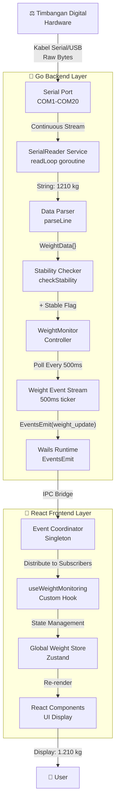
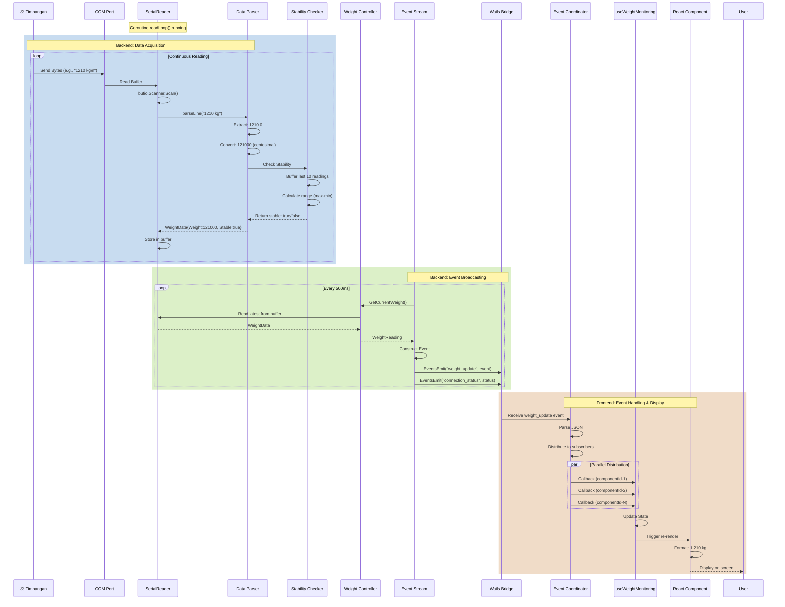
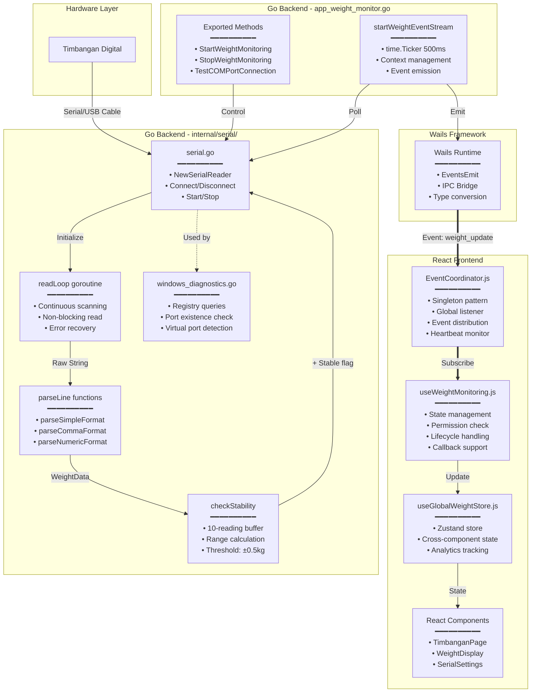
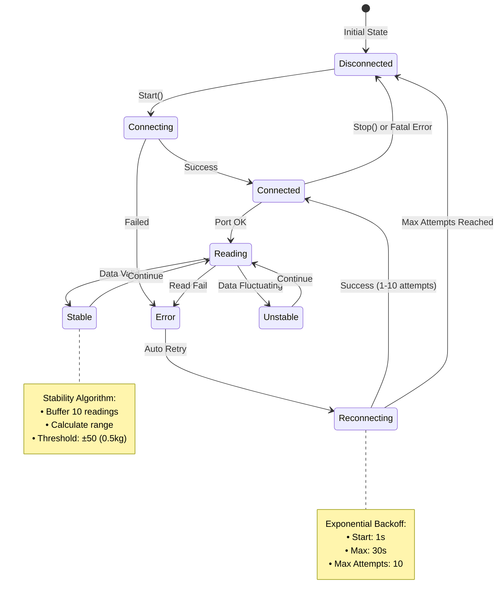
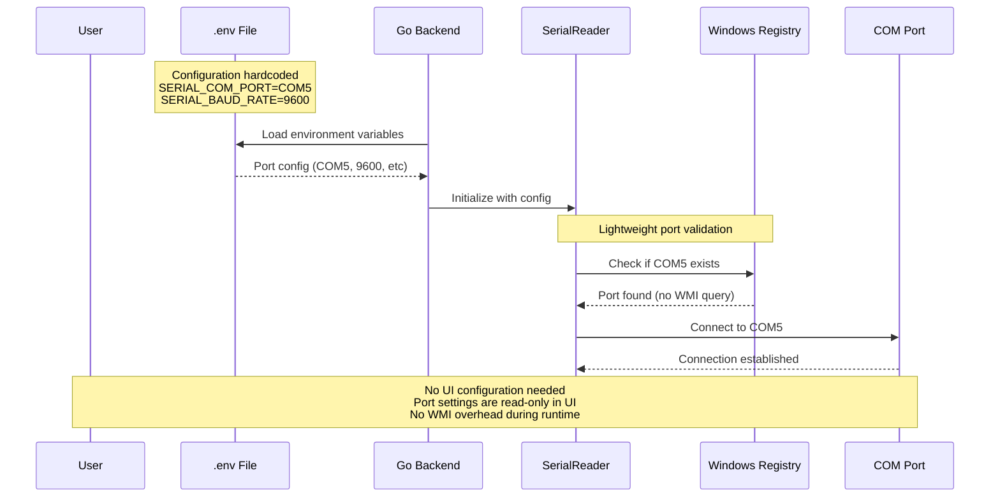

# Arsitektur Komunikasi Serial Port - Smart Mill Scale

Dokumen ini menjelaskan secara detail bagaimana alur komunikasi data dari timbangan digital (Hardware) hingga ke tampilan antarmuka pengguna (Frontend).

## 1. Diagram Alur Data (High-Level Overview)



## 2. Sequence Diagram (Real-time Process Flow)



## 3. Component Interaction Diagram



## 4. Data Structure Flow

```mermaid
flowchart LR
    subgraph Input ["Input dari Timbangan"]
        Raw["Raw String<br/>━━━━━━━━━━<br/>ST,GS,+00120.0kg<br/>atau<br/>1210 kg"]
    end
    
    subgraph Parse1 ["Step 1: Parse"]
        Clean["Clean String<br/>━━━━━━━━━━<br/>1210.0"]
    end
    
    subgraph Parse2 ["Step 2: Convert"]
        Centesimal["Centesimal Integer<br/>━━━━━━━━━━<br/>121000<br/>(untuk 2 desimal)"]
    end
    
    subgraph Parse3 ["Step 3: Stability"]
        Buffer["10-Reading Buffer<br/>━━━━━━━━━━<br/>[120900, 121000, 121100...]<br/>Range check"]
    end
    
    subgraph GoStruct ["Go Struct"]
        WeightData["WeightData<br/>━━━━━━━━━━<br/>Weight: 121000<br/>Unit: kg<br/>Stable: true<br/>Timestamp: time.Now()"]
    end
    
    subgraph Event ["Wails Event"]
        JSON["JSON Object<br/>━━━━━━━━━━<br/>{<br/>  weight: 1210.0,<br/>  unit: 'kg',<br/>  stable: true,<br/>  timestamp: Date<br/>}"]
    end
    
    subgraph FrontendState ["Frontend State"]
        ReactState["React State<br/>━━━━━━━━━━<br/>currentWeight: 1210.0<br/>isStable: true<br/>isConnected: true"]
    end
    
    subgraph Display ["UI Display"]
        UserView["User View<br/>━━━━━━━━━━<br/>1.210 kg<br/>✓ Stabil"]
    end

    Raw --> Clean
    Clean --> Centesimal
    Centesimal --> Buffer
    Buffer --> WeightData
    WeightData --> JSON
    JSON --> ReactState
    ReactState --> UserView
```



## 5. Concurrency & Threading Model

```mermaid
graph TB
    subgraph Main ["Main Thread"]
        MainGo[Main Goroutine<br/>App Initialization]
    end
    
    subgraph Goroutines ["Background Goroutines"]
        ReadLoopG[readLoop()<br/>━━━━━━━━━━<br/>• Infinite loop<br/>• Blocking I/O<br/>• Auto-reconnect]
        
        MonitorG[monitorConnection()<br/>━━━━━━━━━━<br/>• Health check ticker<br/>• 3s interval<br/>• Reconnect trigger]
        
        StreamG[startWeightEventStream()<br/>━━━━━━━━━━<br/>• 500ms ticker<br/>• Poll latest weight<br/>• Emit to frontend]
    end
    
    subgraph Channels ["Go Channels"]
        DataCh[dataChan<br/>buffer: 10<br/>WeightData]
        ErrorCh[errorChan<br/>buffer: 10<br/>Error]
        ReconnectCh[reconnectChan<br/>buffer: 10<br/>Signal]
        StopCh[stopChan<br/>unbuffered<br/>Shutdown]
    end
    
    subgraph JSThread ["JavaScript Main Thread"]
        EventLoop[Event Loop<br/>━━━━━━━━━━<br/>• Async callbacks<br/>• State updates<br/>• Re-renders]
    end

    MainGo -->|Spawn| ReadLoopG
    MainGo -->|Spawn| MonitorG
    MainGo -->|Spawn| StreamG
    
    ReadLoopG -->|Send| DataCh
    ReadLoopG -->|Send| ErrorCh
    MonitorG -->|Send| ReconnectCh
    
    StreamG -->|Receive| DataCh
    StreamG -->|Wails IPC| EventLoop
    
    StopCh -->|Signal| ReadLoopG
    StopCh -->|Signal| MonitorG
    StopCh -->|Signal| StreamG
```

## 6. Error Handling & Recovery



## 7. Configuration & Initialization Flow



## 8. Key Files & Responsibilities

| Layer | File Path | Responsibility |
|-------|-----------|----------------|
| **Hardware** | - | Physical scale device |
| **Configuration** | [`.env`](file:///e:/gosmartmillscale/desktop-app/.env) | Serial port configuration (COM port, baud rate, etc) |
| **Backend - Serial** | [`internal/serial/serial.go`](file:///e:/gosmartmillscale/desktop-app/internal/serial/serial.go) | Low-level port communication, data parsing |
| **Backend - Serial** | [`internal/serial/windows_diagnostics.go`](file:///e:/gosmartmillscale/desktop-app/internal/serial/windows_diagnostics.go) | Registry-based port validation (WMI removed) |
| **Backend - Serial** | `internal/serial/windows_elevation.go` | Permission checking, admin elevation |
| **Backend - Controller** | [`app_weight_monitor.go`](file:///e:/gosmartmillscale/desktop-app/app_weight_monitor.go) | Weight monitoring control, event streaming |
| **Backend - Controller** | `app_weighing.go` | Weighing transaction operations |
| **Wails Bridge** | [`app.go`](file:///e:/gosmartmillscale/desktop-app/app.go) | Application lifecycle, service initialization |
| **Frontend - Service** | [`shared/services/EventCoordinator.js`](file:///e:/gosmartmillscale/desktop-app/frontend/src/shared/services/EventCoordinator.js) | Global event distribution, subscriber management |
| **Frontend - Hook** | [`shared/hooks/useWeightMonitoring.js`](file:///e:/gosmartmillscale/desktop-app/frontend/src/shared/hooks/useWeightMonitoring.js) | React state management, lifecycle handling |
| **Frontend - Store** | `shared/store/useGlobalWeightStore.js` | Global weight state, analytics |
| **Frontend - Settings** | [`features/settings/store/useSettingsStore.js`](file:///e:/gosmartmillscale/desktop-app/frontend/src/features/settings/store/useSettingsStore.js) | Settings state management (read-only port display) |
| **Frontend - UI** | [`features/settings/components/SerialSettings.jsx`](file:///e:/gosmartmillscale/desktop-app/frontend/src/features/settings/components/SerialSettings.jsx) | Serial port settings display (read-only) |

## 9. Performance Characteristics

- **Reading Frequency**: Continuous (as fast as hardware sends)
- **Event Emission**: 500ms (2 updates/second)
- **Stability Check**: Rolling window of 10 readings
- **Reconnect Backoff**: 1s → 2s → 4s → ... → max 30s
- **Max Reconnect Attempts**: 10
- **Channel Buffer Size**: 10 (data), 10 (error), 10 (reconnect)
- **Port Validation**: Registry-only (no WMI overhead)
- **Connection Time**: < 100ms (without WMI queries)

## 10. Example Data Flow

```
INPUT (Timbangan):     "1210 kg\n"
                       ↓
PARSE:                 1210.0 (float)
                       ↓
CONVERT:               121000 (int centesimal)
                       ↓
STABILITY CHECK:       [121000, 121050, 120980, ...] → Range: 70 → Stable ✓
                       ↓
GO STRUCT:             WeightData{Weight: 121000, Stable: true, Unit: "kg"}
                       ↓
WAILS EVENT:           {"name": "weight_update", "data": {...}}
                       ↓
EVENT COORDINATOR:     Distribute to 3 subscribers
                       ↓
REACT STATE:           currentWeight: 1210.0, isStable: true
                       ↓
UI DISPLAY:            "1.210 kg ✓ Stabil"
```
